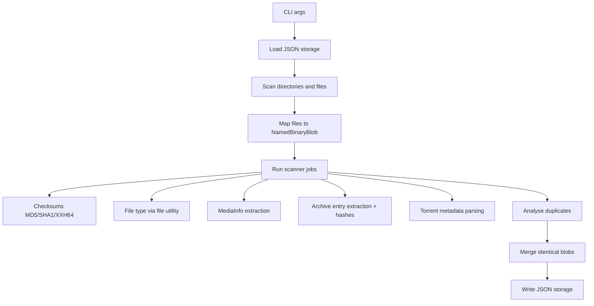
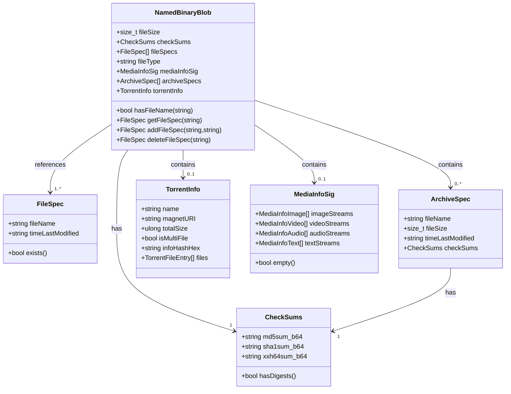
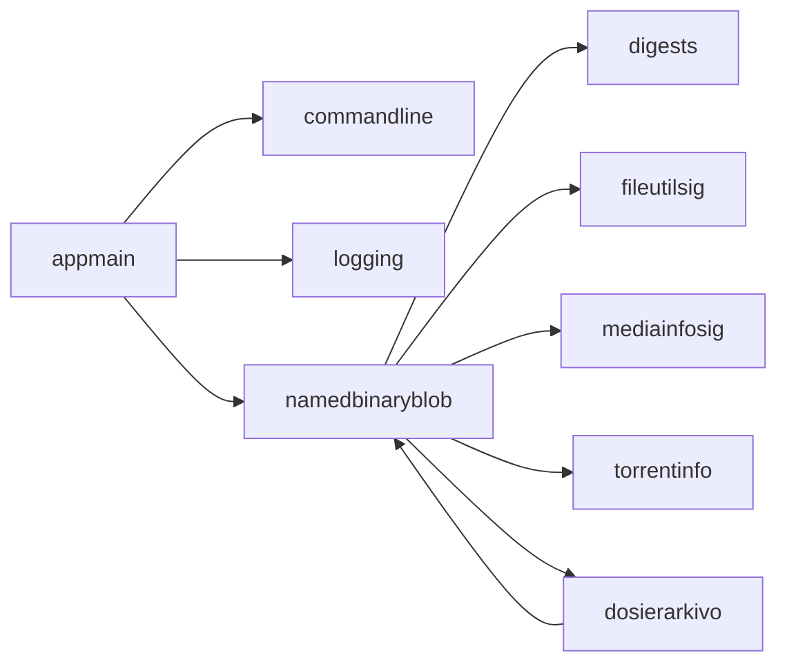

# Architecture and Data Model

This document describes the current `DosierSkanilo` architecture and the
blob-centric storage model.

## 1. High-Level Workflow

## 2. Core Domain Model (UML)

## 3. Job Execution Model

`runScannerJobs()` in `source/appmain.d` supports:

- Single-thread mode
- Multi-thread mode via `std.parallelism.TaskPool`

Each blob can queue independent jobs:

- `updateDigests`
- `updateFileType`
- `updateMediaInfo`
- `updateArchives`
- `updateTorrentInfo`

In multi-thread mode, jobs are submitted first and then consumed while progress
is reported. Ctrl-C is handled to stop long operations safely.

Scheduling policy details:

- Most jobs are queued only when target metadata is missing.
- Archive scheduling is centralized via
  `dosierskanilo.scannerpolicy.shouldQueueArchiveScanJob(...)`.
- Media rescan semantics are asymmetric by execution mode:
  - single-thread mode can force refresh with `--mediasig --rescan-mediasig`
  - multi-thread mode currently queues media jobs only when no
    `mediaInfoSig` exists

## 4. Duplicate Detection Strategy

Duplicates are identified in `analyseData()`:

1. Filter to blobs with complete digests.
2. Group by `fileSize`.
3. Within each size group, group by SHA1.
4. Merge equal blobs (`mergeDataClassObjects`) by combining file specs.
5. Remove invalidated/orphaned blobs (`cleanupDataClassObjs`).

This keeps the model content-oriented while preserving all known file names.

## 5. Serialization and Migration

Storage is JSON using `NamedBinaryBlobWrapper`:

- `dataVersion`
- `dataArray`

On load, legacy fields are migrated in `fixupDataClassArrayIn()`.
On save, outbound compatibility cleanup happens in
`fixupDataClassArrayOut()`.

Relevant code:

- `deserializeDataClassJsonString`
- `deserializeDataClassJsonFile`
- `serializeDataClassArrayFile`

## 6. Archive Handling

`source/dosierarkivo/baseclass.d` provides:

- Factory `fileArchive()` to pick implementation by extension
- Backends: `zip`, `tar`, `rar`, `7z`
- `getEntries()` and `extractEntry()` interface

`updateArchives()` extracts each entry to a temp directory, calculates digests,
and stores results in `ArchiveSpec[]`.

## 7. Torrent Handling

`source/dosierskanilo/torrentinfo.d` includes:

- Internal bencode parser
- SHA1 info-hash computation over bencoded `info` dictionary
- Magnet URI creation
- Single-file and multi-file torrent support

Output is stored in `TorrentInfo` per blob.

## 8. Module Dependencies

## 9. Practical Implications

- The scanner can represent renamed or duplicated files cleanly via `fileSpecs`.
- Metadata extraction is modular and can be expanded with additional tools.
- Archive and torrent support allows deeper content intelligence than plain file
  tree scans.
- JSON persistence plus fixups protects compatibility across schema evolution.
